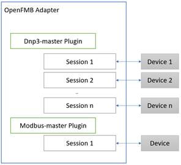
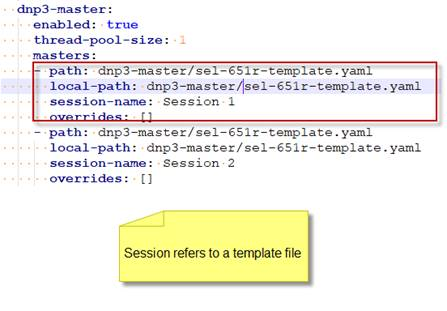

# Introduction

OpenFMB Adapter Configuration Tool (OACT) is a desktop application used to generate Adapter configuration files (in YAML format), which direct how the Adapter behaves at runtime and detail the mappings between legacy protocols to OpenFMB profile messages. 

Each instance of OpenFMB Adapter requires an Adapter Configuration file (aka Main Configuration file) that specifies: 

- What plug-ins (aka software modules) are activated at runtime

- How the plug-in behaves at runtime

- How to translate data points from a device to OpenFMB profile messages

- How to update device data points from a OpenFMB control message

The OpenFMB Adapter Configuration Tool (OACT) has two main functionalities:

- Create main Adapter Configuration file

- Create template file detailing the mappings between legacy protocols and OpenFMB messages

## Main Adapter Configuration

A main Adapter Configuration file consists of two sections: 

- **Logging:** specifies application level logging parameters
- **Plugins:** specify plugins and plug-in specific configurations. There are different plug-ins supported by the Adapter: 
  - Capture: captures and saves OpenFMB messages to local files
  - Replay: reads and replays OpenFMB messages from local files
  - Dnp3-master: protocol plug-in that acquires measurement/status data from a DNP3 outstation and sends control data to DNP3 outstation
  - Dnp3-outstation: exposes OpenFMB reading and status profiles as DNP3 outstation and translates DNP3 commands to OpenFMB control messages
  - Modbus-master: protocol plug-in that acquires measurement/status data from a MODBUS server and sends control data to MODBUS server
  - Modbus-outstation: exposes OpenFMB reading and status profiles as MODBUS server and translate MODBUS write commands to OpenFMB control messages
  - Goose-pub: protocol plug-in that subscribes to GOOSE events and publishes OpenFMB message
  - Goose-sub: protocol plug-in that subscribes to OpenFMB message and publishes GOOSE events
  - MQTT: pub/sub transport protocol used to publish and subscribe OpenFMB messages
  - NATS: pub/sub transport protocol used to publish and subscribe OpenFMB messages
  - TimescaleDB: time series database to store basic electrical measurements and/or to persist OpenFMB messages

 

## Protocol Plug-in Configuration and its Sessions

A protocol plug-in (DNP3 master/outstation, MODBUS master/outstation, GOOSE pub/sub) can have one or more sessions associated with it. A session represents an interactive data interchange between the Adapter and the connecting device.

 

A session configuration is usually referenced to a profile mapping file. The profile mapping files are also known as the ***template files\***. A template file intends to be re-used and shared among sessions that speaks the same protocol to the same device types. For example, a dnp3-master template file (for example, SEL-651R-template.yaml) developed for SEL-651R (a Recloser Control device) can be reused with any dnp3-master sessions that want to talk to a SEL-651R device. In YAML file, it is depicted as follows: 

 
