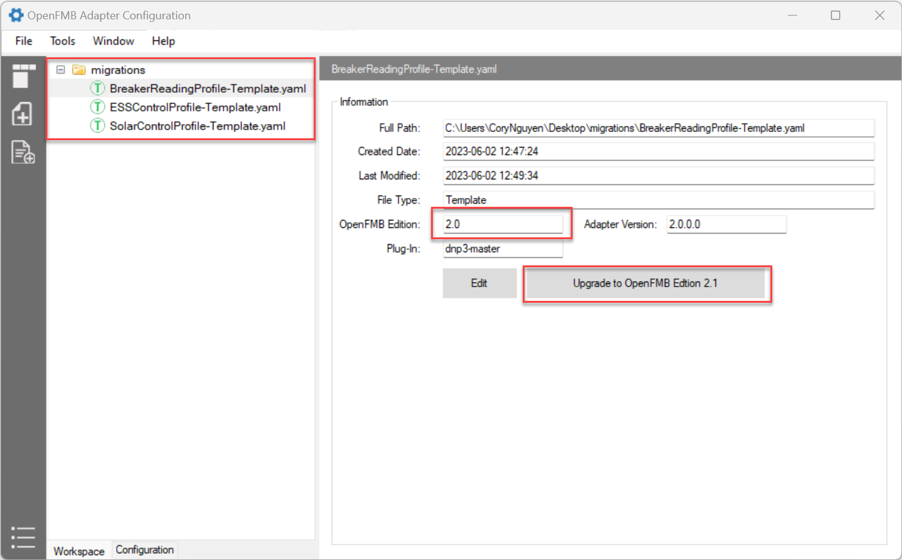
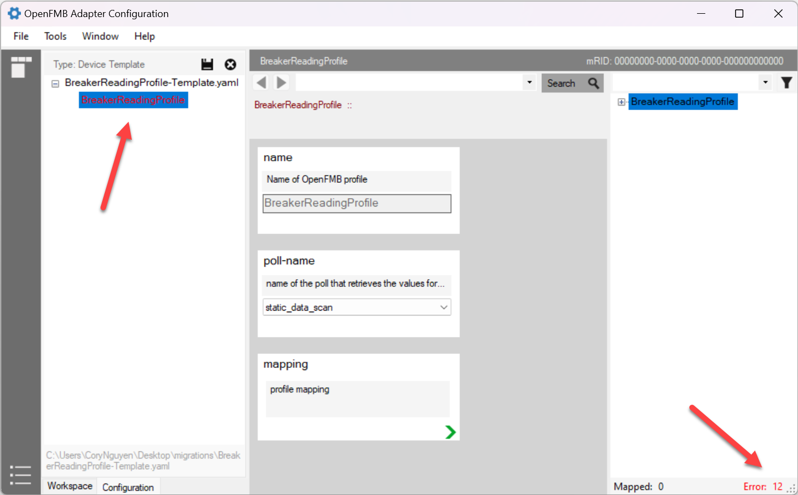
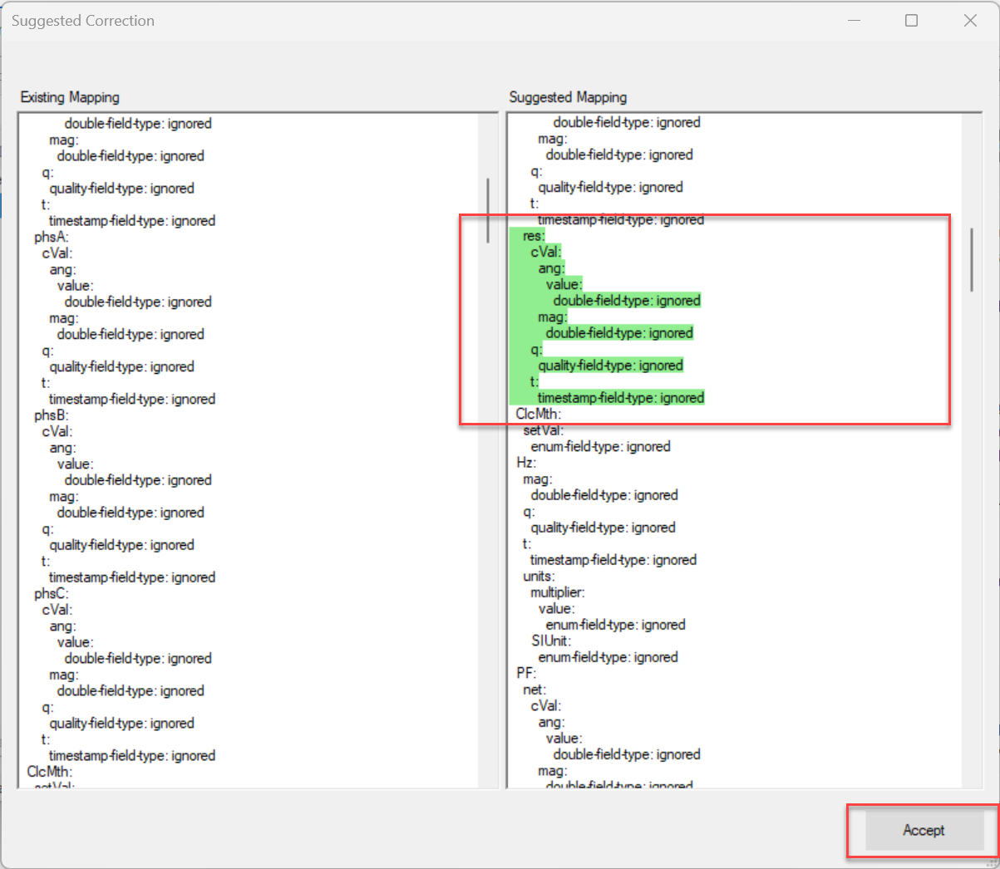
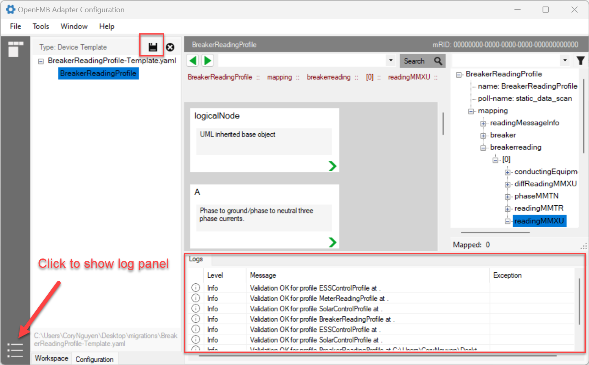
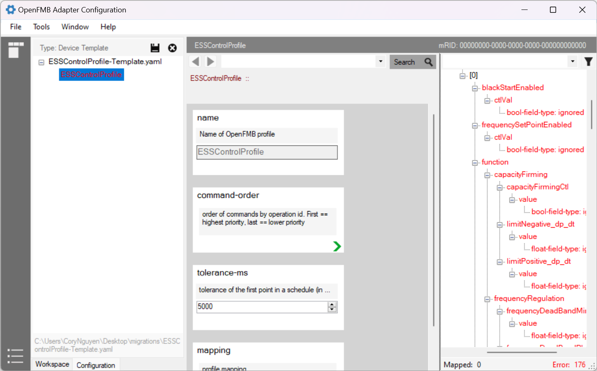
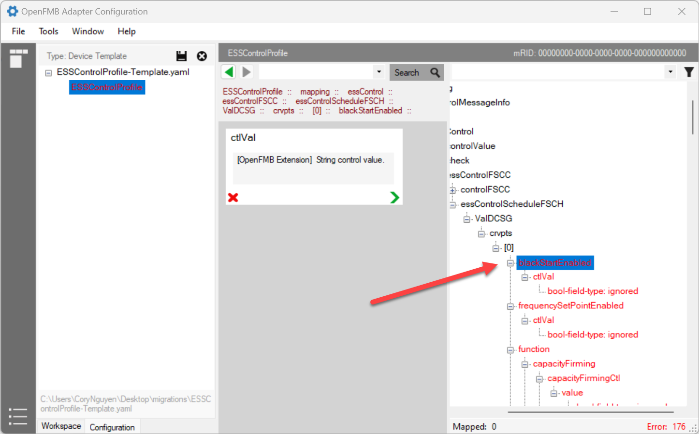
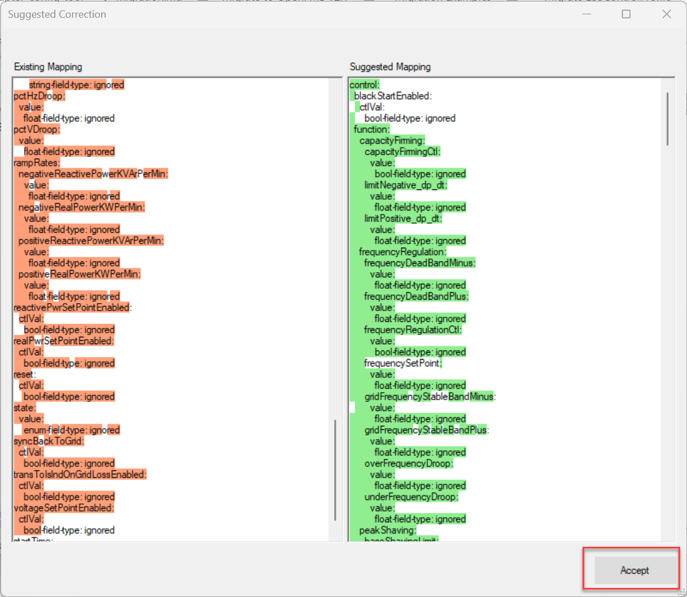

# Migrate to OpenFMB v2.1

This doc will guide you through migrating an existing OpenFMB 2.0 configuration to OpenFMB 2.1.

## Main Differences

- OpenFMB v2.1 supports Grid Code functionalities in ESSControlProfile and SolarControlProfile
- `res` attribute is added to OpenFMB WYE class that would affect all Reading profiles

If you are using `ESSControlProfile`, `SolarControlProfile`, and any of the `ReadingProifle`, migration is required.  The OpenFMB Adapter Configuration Tool (OACT) offers a simple migration process.

## Versioning

The version of a configuration file (*.yaml file) is identified by `file` section.  Using a text editor, open your existing OpenFMB 2.0 configuration file and look for `file` section:

For version 2.0:

```yaml
file:
  id: ...
  edition: 2.0     # Indicate OpenFMB v2.0
  version: 2.0.0.0 # This is the version OpenFMB Adapter 
  plugin: ''
```

For version 2.1:

```yaml
file:
  id: ...
  edition: 2.1     # Indicate OpenFMB v2.1
  version: 2.1.0.0 # This is the version OpenFMB Adapter
  plugin: ''
```

## Migration Examples

:::tip
Always back up your files before performing any migration
:::

Suppose you want to migrate a BreakerReadingProfile, a ESSControlProfile, and SolarControlProfile template to version 2.1.  Using the OACT tool, open the configuration files.



### Migrate BreakerReadingProfile

1. Select `BreakerReadingProfile`, and click on `Upgrade to OpenFMB Edition v2.1`.  Confirm to proceed. Select `BreakerReadingProfile`



2. On the right bottom corner, click on `Error` to expand all erroneous nodes
3. For each erroneous node, right click and select `Suggested correction...`.  A `diff` dialog is popped up showing the comparison of existing and suggesting map configuration.  Verify and click `Accept` button.



4. Once all the erroneous nodes are fixed, save the file and open log panel to make sure the configuration file is validated OK



### Migrate ESSControlProfile

1. Select `ESSControlProfile`, and click on `Upgrade to OpenFMB Edition v2.1`.  Confirm to proceed. Select `ESSControlProfile`



2. On the right bottom corner, click on `Error` to expand all erroneous nodes
3. Scroll up and select the first erroneous node, right click and select `Suggested correction...`.



4. A `diff` dialog is popped up showing the comparison of existing and suggesting map configuration.  Verify and click `Accept` button.



5. Save the file and open log panel to make sure the configuration file is validated OK

### Migrate SolarControlProfile

Refer to [Migrate ESSControlProfile](#migrate-esscontrolprofile).  The process of migrating a SolarControlProfile is very similar.

