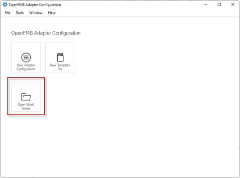
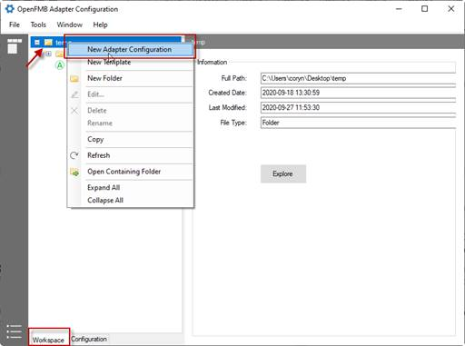
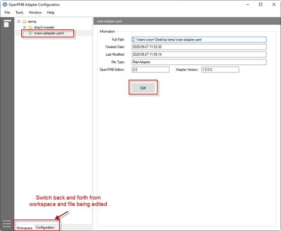
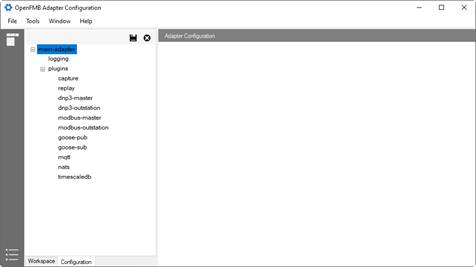
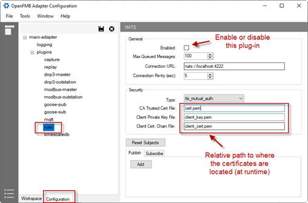
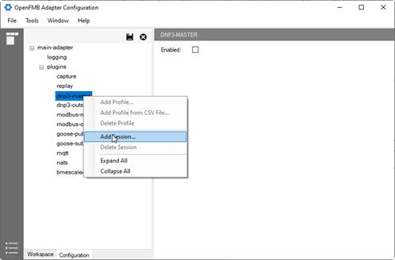
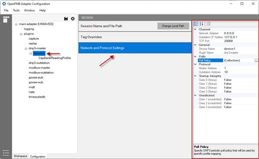
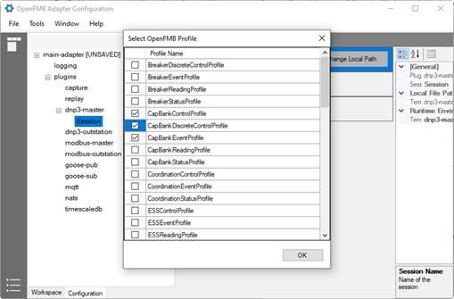
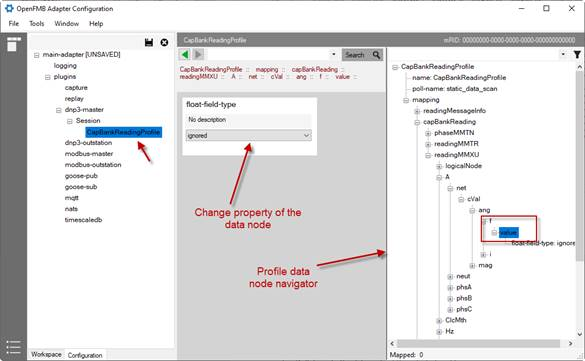

# Getting Started

Follow these steps to configure your first OpenFMB Adapter

## Launch OACT

On your computer, browse to the directory where the tool is and double-click on “OpenFMB.Adapters.Configuration.exe”

## Work Folder

Work folder is a file directory where all the Adapter files are stored. To start editing an Adapter configuration file, launch OACT, and open the folder where the file is located. To open a work folder, on Start Page, click on “Open Work Folder”, then browse to the folder

 

## Create Main Adapter Configuration

To create main configuration from start page:

a.    On Start Page, click on “New Adapter Configuration.” 

b.    When the "New Adapter Configuration" dialog pops up, specify the file name and its location.

c.    Click OK to create. 

To create main configuration from an opened work folder:

a.    Open a work folder.

b.    Select Workspace tab.

c.    Select the work folder node, right-click, and select “New Adapter Configuration.”

d.    Specify file name. Note that the file should be in the work folder.

e.    Click OK to create.

 
​      

## Edit Adapter Configuration

To edit an Adapter configuration:

a.    Open a work folder.

b.    Select Workspace tab.

c.    Select the Adapter configuration to be edited.

d.    On File Information panel, click “Edit” to open it in edit mode.

e.    To toggle between workspace navigator tree and file being edited, click Workspace/Configuration tab at the bottom of the left pane.

 
 

 
 

### Configure a Plugin

To configure a plugin:

a.    Open a main Adapter configuration file in Edit mode.

b.    Select the plugin on the left navigator tree.

c.    On the detail pane, specify the desired parameters.

d.    Click Save to update.

### Configure a Session

Legacy protocol plug-ins such as DNP3 master/outstation, MODBUS master/outstations, and GOOSE pub/sub can have one of more sessions. To add a session:

a.    Right-click on a legacy protocol plug-in, and select “Add Sessions.”

b.    Specify the optional session name and location relatively to the working folder.

c.    Click OK to create.

 

**NOTES:**

*A valid session must have a valid file associated with it. When adding a new session, a file is also created, copied, or referenced. The file associated with a session is also known as the template file. See section 1.2 for more information.* 

Depending on the type of legacy protocol plugin, there are some specific parameters, such as device IP address, poll policy, and master/outstation addresses, that must be set.  

To set protocol-specific parameters for a session: 

a.    Select the session.

b.    On center pane, select “Network and Protocol Settings.”

c.    On the property grid at right panel, make the appropriate changes.

d.    Click Save to update.

 

To add OpenFMB profile(s) to a session: 

a.    Select the session.

b.    Right click and select “Add Profile.” A profile selection dialog pops up.

c.    Select profile(s) to be added and click OK.

 

### Profile Mappings

To define mappings between the legacy protocol and OpenFMB profile:

a.    Select a profile on the left navigator tree.

b.    Drill down to the data node of the selected profile.

c.    In the center pane, select and change properties of that data node.

d.    Repeat the steps for all data nodes that must be mapped.

e.    Click Save to update.

## Create Template File

To create a template file from the start page:

a.    On Start Page, click on “New Template File.” 

b.    When the "New Template File" dialog pops up, specify the file name and its location.

c.    Click OK to create. 

To create a template from an opened work folder:

a.    Open a work folder.

b.    Select Workspace tab.

c.    Select the work folder node, right click, and select “New Template File.”

d.    Specify the file name. Note that file location should be in the work folder.

e.    Click OK to create.

## Edit Template File

Editing a template file is like editing a session for protocol plug-ins. Refer to “Configure a Session” and “Profile Mappings” sections. 
