# Referenced Setup

In this section, you will learn how to use the [OpenFMB Adapter Config tool](/docs/adapter-config-tool) to create configuration files for the [OpenFMB Adapter](/docs/adapter) used by the [Referenced Setup](/docs/openfmb/reference).

As specified in the [Referenced Setup](../openfmb/reference), there are four types of electrical equipment:

- **Building load**: meter device speaking DNP3
- **Solar PV**: solar system speaking MODBUS
- **Battery energy storage**: battery speaking MODBUS
- **Switch (isolator) at PCC (Point of Common Coupling)**: isolate switch speaking DNP3

## Work Folder

Work folder is a folder on your local computer where the Adapter configuration files are located.

1. Launch OpenFMB Adapter Config tool, then click on "Open Work Folder," and browse to open a folder where you will store the Adapter configuration files.  For this tutorial, the selected folder name is `demo`.

   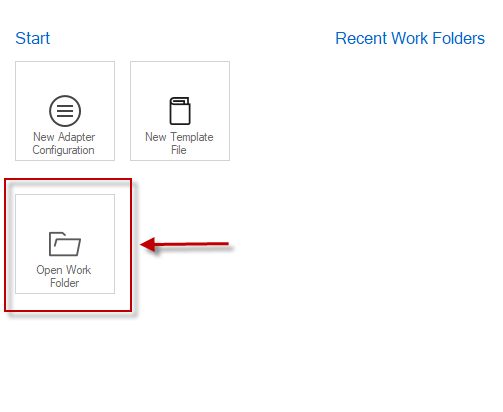

2. The folder is loaded.

   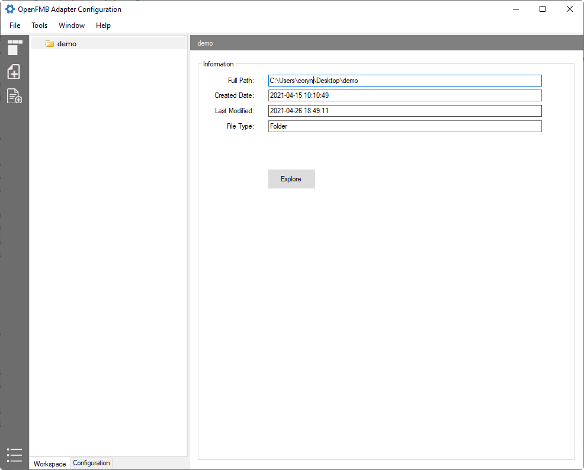


### Building Load Adapter Configuration

The meter device used for building load metering is a DNP3 device with the following simple DNP3 data points:

   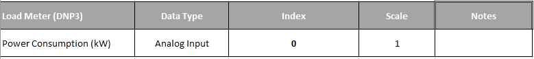

We use `MeterReadingProfile` for the building load.

1. First, let's create a subfolder for the building load.  From the left pane, right-click on the folder named `demo`, select `New Folder`, and type in `building`.

2. On the newly created subfolder `building`, right-click, and select `New Adapter Configuration`.

3. On `New Adapter Configuration` dialog, select `dnp3-master` plugin, then check `MeterReadingProfile` on the right pane.  Click the OK button.
   
   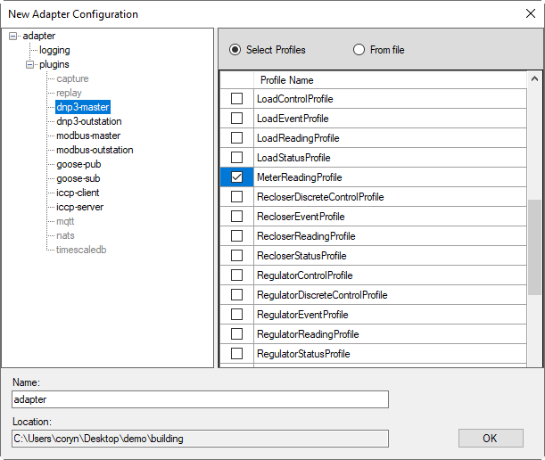

4. Now on the workspace tree view, you will see a structure similar to the image below.  Select `adapter.yaml` on the tree view, then click on `Edit` to launch configuration editor.

   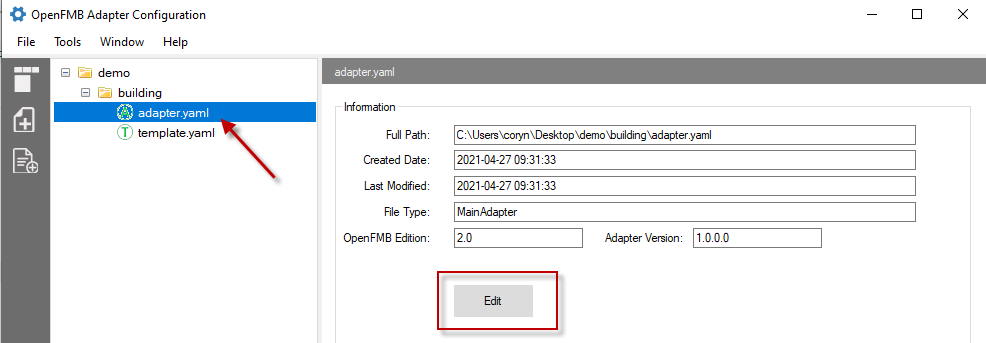

5. The configuration editor screen has two main panes:  a left navigator pane and details pane.  Familiarize yourself with the tool by clicking on each tree node of the left navigator.  

:::Note
    - Plug-ins node includes the supported plugins that you can choose to enable
    - Protocol-related plugin can have one or more sessions associated with it.  
:::

6. For this reference setup, you need to enable `NATS` and `dnp3-master`.  Click on `plugins` node and check `NATS` and `dnp3-master`

7. To do the protocol mapping between DNP3 and OpenFMB MeterReadingProfile, expand `dnp3-master` node, session, then select `MeterReadingProfile`. 
    - Assign MRID of the metering device to the profile by clicking on the `mRID` on top right corner, then click on `...` button.  Enter `0648ef71-cb63-4347-921a-9dbf178da687` as the [mRID](../openfmb/reference#device-mrid).
    - Map DNP3 `analog input index 0` to `W` of the `readingMMXU` in the MeterReadingProfile
        - Type `W` in the search box (middle screen) to see a list of available `W` data items.  Select `W total (mag)` for the total power consumption (mag).
          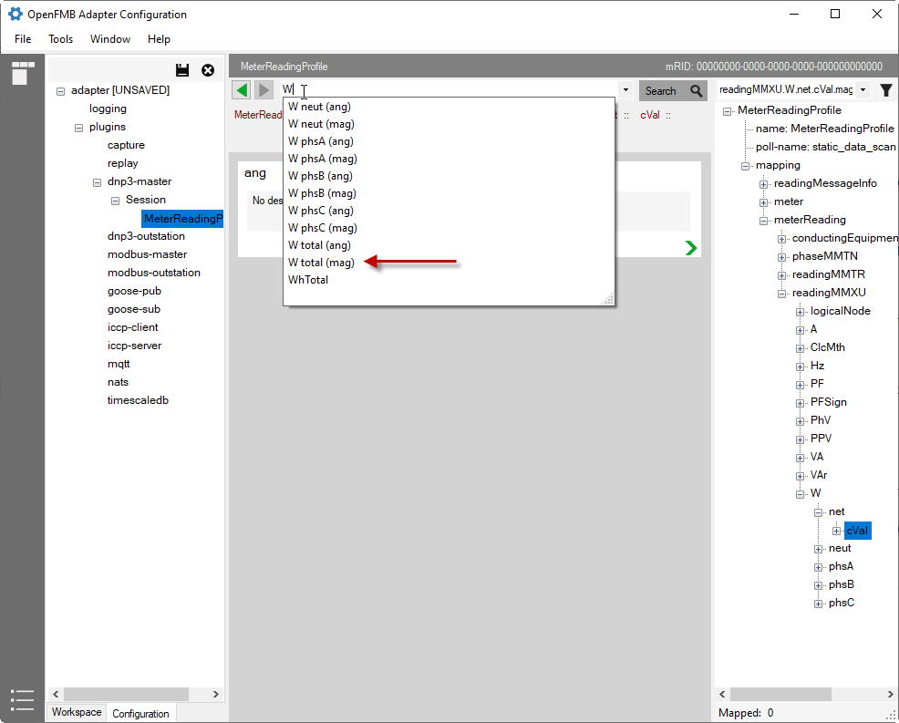
        - Drill down on the `mag` by clicking on the green arrow at the right bottom corner of the `mag` box.
        - On the field type dropdown, select `mapped'. 
        - On `Source Type`, select `analog`.
        - On `Index`, enter 0
        - On `Scale`, enter 1
        - You have completed the mapping of `Analog Input 0` to `meterReading.readingMMXU.W.net.cVal.mag` with `scale factor 1`.
        
          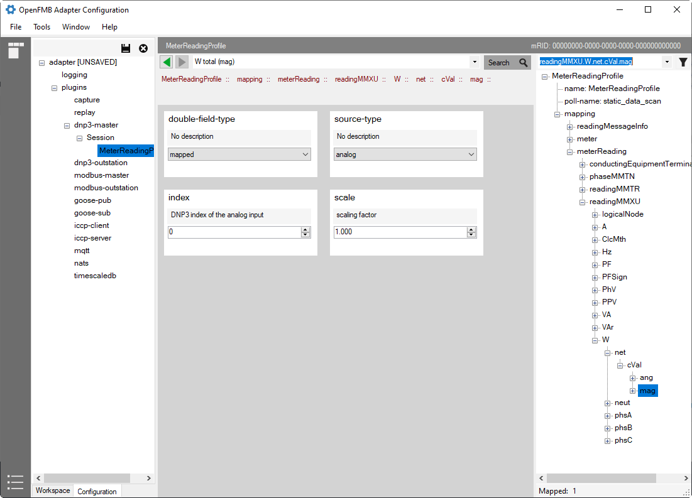

8. Configure NATS by expanding `plugins` and select NATS.
    - Make sure that `enabled` checkbox is checked.
    - Enter NATS connection URL.
    - Select `none` as `Security Type`.
    - Click on `Reset Subjects` to populate the publishing profiles.
    
9. Save your configuration by clicking the `Save` button or simply CTRL+S

### Solar Adapter Configuration

The solar device is a MODBUS device with the following simple MODBUS data points:

   

We use `SolarReadingProfile` for the solar power production and `SolarStatusProfile` for state indication.

1. First, let's create a subfolder for the solar device.  From the left pane, right-click on the folder named `demo`, select `New Folder`, and type in `solar`.

2. On the newly created subfolder `solar`, right-click and select `New Adapter Configuration`.

3. On `New Adapter Configuration` dialog, select `modbus-master` plugin, then check `SolarReadingProfile` and `SolarStatusProfile` on the right pane.  Click OK.

4. Now on the workspace tree view, you will see a structure similar to the image below.  Select `adapter.yaml` on the tree view, then click on `Edit` to launch configuration editor.

   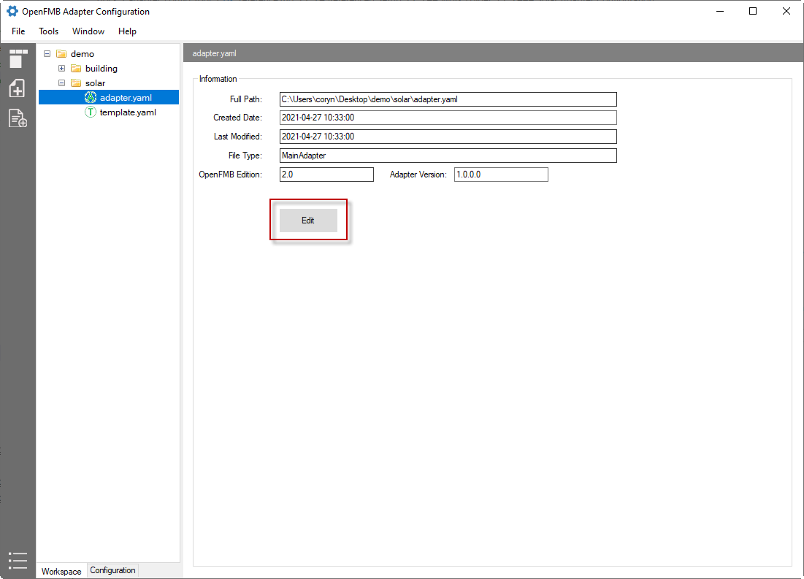

5. For this reference setup, you need to enable `NATS` and `modbus-master`.  Click on `plugins` node and check `NATS` and `modbus-master`.

6. To do the protocol mapping between MODBUS and OpenFMB SolarReadingProfile, expand `modbus-master` node, session, then select `SolarReadingProfile` 
    - Assign MRID of the metering device to the profile by clicking on the `mRID` on top right corner, then click on `...` button.  Enter `540b292a-e600-4ae4-b077-40b892ae6970` as the [mRID](../openfmb/reference#device-mrid).
    - Map MODBUS `Holding Register Pair [0, 1]` to `W` of the `readingMMXU` in the SolarReadingProfile
        - Type `W` in the search box (middle screen) to display a list of available `W` data items.  Select `W total (mag)` for the total power consumption (mag).
          
        - Drill down on the `mag` by clicking on the green arrow at the right bottom corner of the `mag` box
        - On the field type dropdown, select `mapped'. 
        - On `Source Type`, select `holding_register`.
        - On `Register Mapping`, select `uint32`.
        - On `Scale`, enter 0.01
        - On `Lower Index`, enter 0
        - On `High Index`, enter 1
        - You have completed the mapping of `Holding Register Pair [0, 1]` to `solarReading.readingMMXU.W.net.cVal.mag` with `scale factor 0.01`.
        
          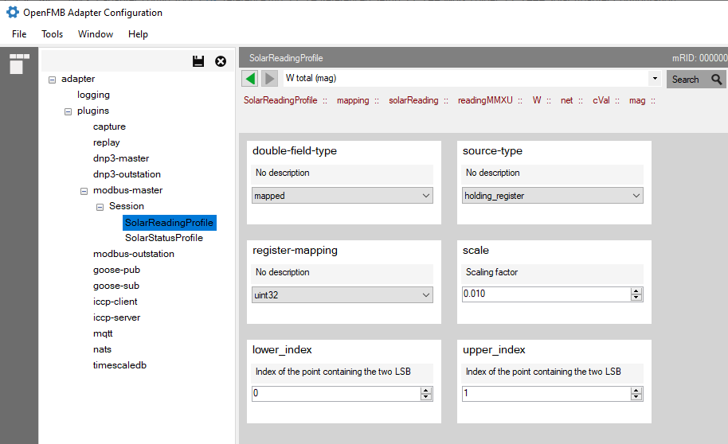

7. To do the protocol mapping between MODBUS and OpenFMB SolarStatusProfile, expand `modbus-master` node, session, then select `SolarStatusProfile` 
    - Assign MRID of the metering device to the profile by clicking on the `mRID` on top right corner, then click on `...` button.  Enter `540b292a-e600-4ae4-b077-40b892ae6970` as the [mRID](../openfmb/reference#device-mrid).
    - Map MODBUS `Coil 0` to `state` of the `PointStatus` in the SolarStatusProfile
        - On the right profile navigator tree, drill down to `state` with the following path:
        ```
          solarStatus -> solarStatusZGEN -> solarEventAndStatusZGEN -> PointStatus -> state
        ```        
        - On the field type dropdown, select `mapped'.
        - On `Source Type`, select `coil`.
        - On `Enum Field Type`, select `single-bit`.    
        - On `Index`, enter 0
        - On `When-True`, select `StateKind_on`.
        - On `When-False`, select `StateKind_off`.
        - You have completed the mapping of `Coil 0` to `solarStatus.solarStatusZGEN.solarEventAndStatusZGEN.PointStatus.state.value`. 
            - when Coil 0 = true, the state value is equivalent to `StateKind_on`. 
            - when Coil 0 = false, the state value is equivalent to `StateKind_off`.
        
          

8. Configure NATS by expanding `plugins` and select NATS.
    - Make sure that the `enabled` checkbox is checked.
    - Enter NATS connection URL.
    - Select `none` as `Security Type`.
    - Click on `Reset Subjects` to populate the publishing profiles.
    
9. Save your configuration by clicking the `Save` button or simply CTRL+S.

### Battery Adapter Configuration

The battery is a MODBUS device with the following simple MODBUS data points:

   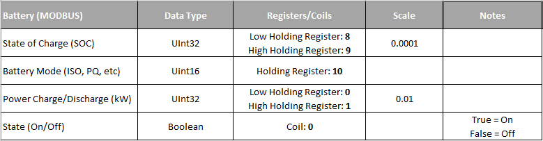

We use `ESSReadingProfile` for the solar power charge/discharge and `ESSStatusProfile` for state, state of charge, and battery mode.

1. First, let's create a subfolder for the battery.  From left pane, right click on folder named `demo`, select `New Folder` and type in `battery`.

2. On the newly created subfolder `battery`, right-click, and select `New Adapter Configuration`.

3. On `New Adapter Configuration` dialog, select `modbus-master` plugin, then check `ESSReadingProfile` and `ESSStatusProfile` on the right pane.  Click OK.

4. Now on the workspace tree view, you will see a structure similar to the image below.  Select `adapter.yaml` on the tree view, then click on `Edit` to launch configuration editor.

5. For this reference setup, you need to enable `NATS` and `modbus-master`.  Click on `plugins` node and check `NATS` and `modbus-master`

6. To do the protocol mapping between MODBUS and OpenFMB SolarReadingProfile, expand `modbus-master` node, session, then select `ESSReadingProfile` 
    - Assign MRID of the metering device to the profile by clicking on the `mRID` on top right corner, then click on `...` button.  Enter `836a8638-b448-4961-8258-47aa18e05f65` as the [mRID](../openfmb/reference#device-mrid).
    - Map MODBUS `Holding Register Pair [0, 1]` to `W` of the `readingMMXU` in the ESSReadingProfile
        - Type `W` in the search box (middle screen) to display a list of available `W` data items.  Select `W total (mag)` for the total power consumption (mag).
          
        - Drill down on the `mag` by clicking on the green arrow at the right bottom corner of the `mag` box.
        - On the field type dropdown, select `mapped'. 
        - On `Source Type`, select `holding_register`.
        - On `Register Mapping`, select `uint32`.
        - On `Scale`, enter 0.01
        - On `Lower Index`, enter 0
        - On `High Index`, enter 1
        - You now complete the mapping of `Holding Register Pair [0, 1]` to `essReading.readingMMXU.W.net.cVal.mag` with `scale factor 0.01`.        

7. To do the protocol mapping between MODBUS and OpenFMB ESSStatusProfile, expand `modbus-master` node, session, then select `ESSStatusProfile` 
    - Assign MRID of the metering device to the profile by clicking on the `mRID` on the top right corner, then click on `...` button.  Enter `836a8638-b448-4961-8258-47aa18e05f65` as the [mRID](../openfmb/reference#device-mrid).
    - Map MODBUS `Coil 0` to `state` of the `PointStatus` in the ESSStatusProfile
        - On the right profile navigator tree, drill down to `state` with the following path:
        ```
          essStatus -> essStatusZGEN -> essEventAndStatusZGEN -> PointStatus -> state
        ```        
        - On the field type dropdown, select `mapped'.
        - On `Source Type`, select `coil`.
        - On `Enum Field Type`, select `single-bit`.     
        - On `Index`, enter 0
        - On `When-True`, select `StateKind_on`.
        - On `When-False`, select `StateKind_off`
        - You now complete the mapping of `Coil 0` to `essStatus.solarStatusZGEN.essEventAndStatusZGEN.PointStatus.state.value` 
            - when Coil 0 = true, the state value is equivalent to `StateKind_on`. 
            - when Coil 0 = false, the state value is equivalent to `StateKind_off`.
    - Map MODBUS `Holding Register 10` to `mode` of the `PointStatus` in the ESSStatusProfile
        - On the right profile navigator tree, drill down to `state` with the following path:
        ```
          essStatus -> essStatusZGEN -> essEventAndStatusZGEN -> PointStatus -> mode -> setVal
        ```        
        - On the field type dropdown, select `mapped'. 
        - On `Source Type`, select `holding_register`.
        - On `Enum Field Type`, select `single-register`.      
        - On `Index`, enter 10
        - On `Mask`, enter 65535
        - Drill down to `mapping`.
        - On first element (index [0]), select `GridConnectModeKind_VSI_ISO` and enter 2002 as the value.
        - Go back up to 'mapping`,  and click `Add New Element`.
        - On second element (index [1]), select `GridConnectModeKind_VSI_PQ` and enter 2000 as the value
        - Go back up to 'mapping`, and click `Add New Element`
        - On third element (index [2]), select `GridConnectModeKind_UNDEFINED` and enter 0 as the value
        - You now complete the mapping of `Holding Register 10` to `essStatus.essStatusZGEN.eSSEventAndStatusZGEN.PointStatus.mode.setVale` 
            - when Register 10 = 2000, the mode value is equivalent to `GridConnectModeKind_VSI_PQ` 
            - when Register 10 = 2002, the mode value is equivalent to `GridConnectModeKind_VSI_ISO`
            - when Register 10 = 0, the mode value is equivalent to `GridConnectModeKind_UNDEFINED`        
    - Map MODBUS `Holding Register Pair [8, 9]` to `soc` of the `essStatusZBAT`
        - On the right profile navigator tree, drill down to `soc` with the following path:
        ```
            essStatus -> essStatusZBAT -> Soc -> mag
        ```
        - On the field type dropdown, select `mapped'. 
        - On `Source Type`, select `holding_register`.
        - On `Register Mapping`, select `uint32`.
        - On `Scale`, enter 0.0001
        - On `Lower Index`, enter 8
        - On `High Index`, enter 9
    

8. Configure NATS by expanding `plugins` and select NATS.
    - Make sure that the `enabled` checkbox is checked.
    - Enter NATS connection URL.
    - Select `none` as `Security Type`.
    - Click on `Reset Subjects` to populate the publishing profiles.
    
9. Save your configuration by clicking `Save` button or simply CTRL+S.


### Switch Adapter Configuration

The switch is an DNP3 device with the following simple DNP3 data points:

   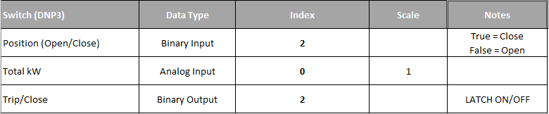

We use `SwitchReadingProfile` for the total kW reading, `SwitchStatusProfile` for switch position, and `SwitchDiscreteControlProfile` for the trip/close command.

1. First, let's create a subfolder for the switch.  From the left pane, right-click on folder named `demo`, select `New Folder`, and type in `switch`.

2. On the newly created subfolder `switch`, right-click and select `New Adapter Configuration`.

3. On the `New Adapter Configuration` dialog, select `dnp-master` plugin, then check `SwitchReadingProfile`, `SwitchStatusProfile`, and `SwitchDiscreteControlProfile` on the right pane.  Click OK.

4. Now on the workspace tree view, you will see a structure similar to the image below.  Select `adapter.yaml` on the tree view, then click on `Edit` to launch the configuration editor.

5. For this reference setup, you need to enable `NATS` and `dnp3-master`.  Click on `plugins` node and check `NATS` and `dnp3-master`

6. To do the protocol mapping between DNP3 and OpenFMB SwitchReadingProfile, expand `dnp3-master` node, session, then select `SwitchReadingProfile` 
    - Assign MRID of the metering device to the profile by clicking on the `mRID` on top right corner, then click on `...` button.  Enter `e6768784-48ad-40e9-af2a-9676413d4d6a` as the [mRID](../openfmb/reference#device-mrid).
    - Map DNP3 `analog input index 0` to `W` of the `readingMMXU` in the SwitchReadingProfile
        - Type `W` in the search box (middle screen) to display a list of available `W` data items.  Select `W total (mag)` for the total power consumption (mag).
            
        - Drill down on the `mag` by clicking on the green arrow at the right bottom corner of the `mag` box.
        - On the field type dropdown, select `mapped'.
        - On `Source Type`, select `analog`.
        - On `Index`, enter 0
        - On `Scale`, enter 1
        - You now complete the mapping of `Analog Input 0` to `switchReading[0].readingMMXU.W.net.cVal.mag` with `scale factor 1`.
    - Map DNP3 `binary input index 2` to `Pos` of the `switchStatusXSWI` in the SwitchStatusProfile
        - On the right profile navigator tree, drill down to `Pos` with the following path:
        ```
            switchStatus -> switchStatusXSWI -> Pos -> phs3 -> stVal
        ```
        - On the field type dropdown, select `mapped'. 
        - On `Source Type`, select `binary`.
        - On `When-True`, select `DbPosKind_closed`.
        - On `When-False`, select `DbPosKind_open`.
        - You have completed the mapping of `binary input index 2` to `switchStatus.switchStatusXSWI.Pos.phs3.stVal` 
            - when `binary input index 2 = true`, the state value is equivalent to `DbPosKind_closed` 
            - when `binary input index 2 = false`, the state value is eqivalent to `DbPosKind_open`
    - Map DNP3 `binary output index 2` to `Pos` of the `switchStatusXSWI` in the SwitchStatusProfile
        - On the right profile navigator tree, drill down to `Pos` with the following path:
        ```
            switchDiscreteControl -> switchDiscreteControlXSWI -> Pos -> phs3 -> ctlVal
        ```
        - On the field type dropdown, select `mapped'.
        
        - Drill down on `When-True` and first element (index [0]).
        - On `command-action-type`, select `g12v1` (Group 12 Variation 1).
        - On `index`, enter 2
        - On `command-id`, click on `+` button and enter `command-1`.  Click OK.
        - On `Operation Type`, select `LATCH_ON`.
        - Drill down on `When-False` and first element (index [0]).
        - On `command-action-type`, select `g12v1` (Group 12 Variation 1).
        - On `index`, enter 2
        - On `command-id`, click on `+` button and enter `command-2`.  Click OK.
        - On `Operation Type`, select `LATCH_OFF`.
        - You have completed the mapping of `binary output index 2` to `switchDiscreteControl.switchDiscreteControlXSWI.Pos.phs3.ctlVal`. 
            - when receiving `switchDiscreteControl.switchDiscreteControlXSWI.Pos.phs3.ctlVal = true`, the adapter will set binary output 2 to `true`
            - when receiving `switchDiscreteControl.switchDiscreteControlXSWI.Pos.phs3.ctlVal = false`, the adapter will set binary output 2 to `false`
        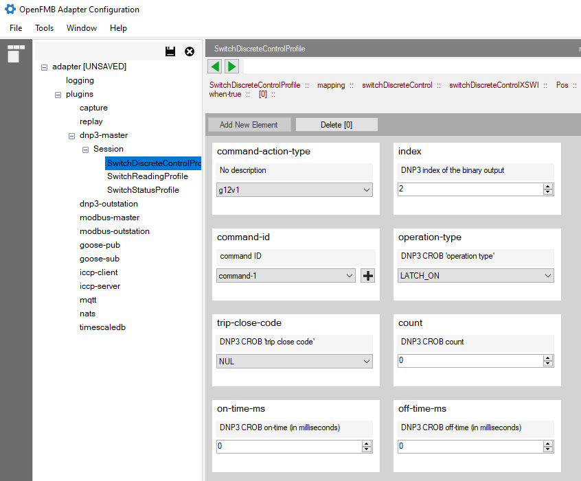

7. Configure NATS by expanding `plugins` and select NATS.
    - Make sure that the `enabled` checkbox is checked.
    - Enter NATS connection URL.
    - Select `none` as `Security Type`.
    - Click on `Reset Subjects` to populate the publishing profiles.
    
8. Save your configuration by clicking the `Save` button or simply CTRL+S.
