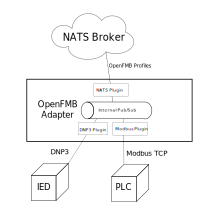
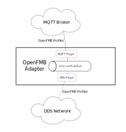

# Introduction

The OpenFMB Adapter is a portable C++ application which can both translate
non-OpenFMB protocols into OpenFMB, and bridge various OpenFMB transports such
as NATS, MQTT, and DDS. The sections below describe these two primary use cases.

## Protocol translator

The adapter can act as a protocol translator for equipment communicating with
other, protocols such as DNP3 (IEEE 1815-2012), and Modbus TCP. Several
other protocols are supported by Open Energy Solutions but require a license as
they use licensed protocol libraries.

The mapping from the other protocol to OpenFMB is configured using a YAML model
of a specific OpenFMB profile, and protocol specific metadata. The adapter then
communicates with the device using the other protocol to obtain the values. It
fills in a protobuf representation of the profile and publishes it to an
internal bus to which other plugins may subscribe. When acting as a translator,
a native plugin will then publish the profile to an OpenFMB transport such as
NATS.

The following example shows an adapter used to connect equipments using legacy
protocols to an OpenFMB NATS broker.

## Transport bridge

The adapter can also be used as a transport bridge between two OpenFMB networks.
An adapter can be placed on the edge between the two networks and subscribe to
one network. The profiles can be filtered, and some or all of them can be
republished onto the other network.

When the adapter is used as a transport bridge between networks, it is necessary
to ensure that a bridged message is not returned to a previous network. For
instance, bidirectional bridging of all OpenFMB Readings profiles between two
networks would create an infinite loop.

If all the control applications were in one network and all IEDs in another
network the event, reading, and status messages would need to be bridged to the
network with the control applications and the control messages would need to be
bridged to the network with the IEDs.

On the other hand, if all the control applications and all IEDs are on both
networks for bridging messages would also need to be filtered by device mRID to
restrict flow to the proper direction.

The example below shows an adapter configured to bridge an OpenFMB MQTT broker to
an OpenFMB DDS network.

