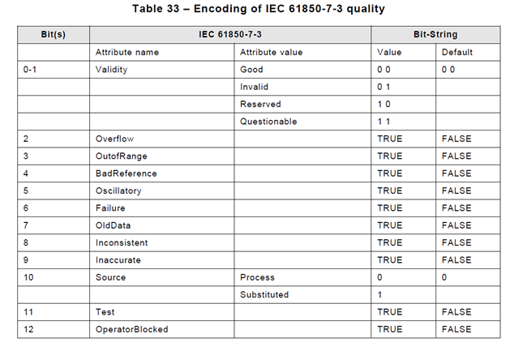
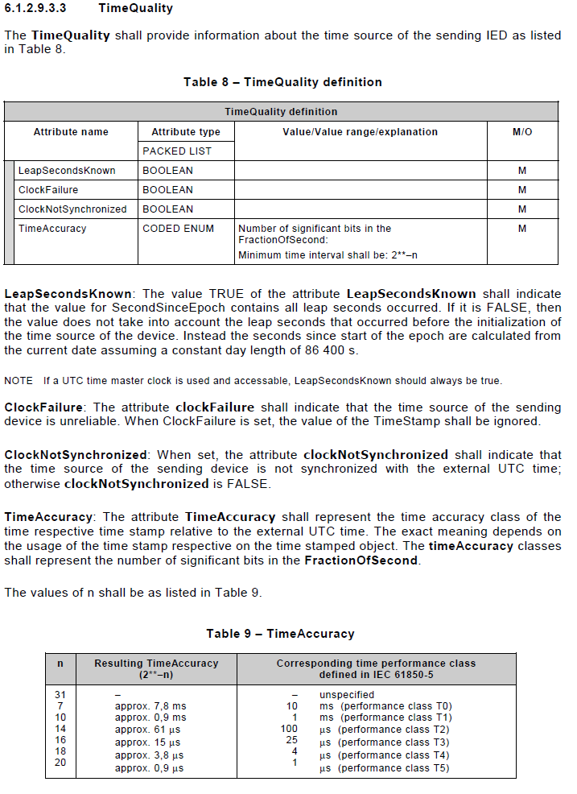

# GOOSE

GOOSE (Generic Object Oriented Substation Events) is a control model defined in
IEC 61850 based on Ethernet broadcast for transferring event data in a fast and
reliable way.

## libpcap

GOOSE messages are sent as raw Ethernet frames. Therefore, a low-level network
access is required. The adapter uses [libpcap](https://www.tcpdump.org/) for
this. Make sure it is installed on your system.

On Windows, it is recommended to use [npcap](https://nmap.org/npcap/), an
equivalent library with the same API. [WinPcap](https://www.winpcap.org/) is
still an option, but is not recommended. It is based on deprecated features of
Windows and no future upgrade is planned.

## Structure

The `gooseStructure` section is used to describe the structure of the received
or published messages. If the structure is used for receiving GOOSE messages,
the received messages must fit exactly with what is received, otherwise an error
will be printed. For each field in the message, a unique name must be provided.
That name will be used in the mappings defined later.

The following table describes all the possible values:

| Type             | Description                                                                                                 |
|------------------|-------------------------------------------------------------------------------------------------------------|
| ignored          | The field is expected in the GOOSE message, but not used. Only valid in `goose-pub`.                        |
| structure        | The field is a structure. No name is associated to it, but an array of elements must be specified.          |
| array            | The field is an array. No name is associated to it, but an array of elements must be specified.             |
| boolean          | `true` or `false` value.                                                                                    |
| integer          | Int64 value.                                                                                                |
| floating         | Double-precision floating point value.                                                                      |
| visible_string   | ASCII string.                                                                                               |
| mms_string       | UTF8 string.                                                                                                |
| bitstring        | Bit string.                                                                                                 |
| generalized_time | Datetime possibly with timezone calculations. Precise to the milliseconds.                                  |
| binary_time      | Datetime based on epoch or 1984. Date and time after midnight are stored separately. Precise to the second. |
| utc_time         | Datetime based on epoch. Precise to the microseconds.                                                       |

The following table lists the **unsupported** types:

| Unsupported types |
|-------------------|
| Unsigned Integer  |
| Octet String      |
| BCD               |
| Boolean Array     |
| Object Identifier |

Here is an example of a valid configuration:

```yaml
gooseStructure:
  - structure:
      - floating: A
      - integer: B
      - boolen: C
      - structure:
          - visible_string: D
          - binary_time: E
  - array:
      - integer: W.phsA
      - integer: W.phsB
      - integer: W.phsC
  - ignored: ignored
```

## GOOSE Publisher

`goose-pub` is used to listen for GOOSE events and to publish them to the
internal bus. The configuration is composed of general settings, a [GOOSE
structure](./#structure) definition and profile mappings.

A message is published only when a different `stNum` is received, meaning the
retransmissions do not generate OpenFMB messages.

VLAN is currently not supported. If a message is received with an IEEE 802.1Q
EtherType (`0x8100`) and the internal EtherType set to GOOSE Type 1 (`0x88B8`), then
the frame is accepted, ignoring the VLAN value.

### General settings

- `networkAdapter`: The network adapter identifies what network card to use for
  receiving the GOOSE messages. On Linux systems, you can usually get the it
  with `ifconfig` or a similar utility. The name is usually `ethX` or similar.
  On Windows, the network adapter is a UUID similar to
  `\Device\NPF_{XXXXXXXX-XXXX-XXXX-XXXX-XXXXXXXXXXXX}`. You can find the value
  by opening Wireshark, going to "Manager Interfaces" and looking at the
  "Interface Name".
- `appId`: The application identifier distinguishes the application association.
  See IEC 61850-8-1 Annex C for more details.
- `goCbRef`: GOOSE Control Block Reference is a string that identifies the
  equipment talking.

### Mapping

For each mapped field, a `name` attribute must be specified. The name must match
with one the fields defined in the [GOOSE structure](./#structure). The GOOSE
structure field must also be compatible with the mapped field type. The
following table shows the valid conversions:

| OpenFMB Type        | Supported GOOSE Type Conversion                        |
|---------------------|--------------------------------------------------------|
| `bool`              | `bool`                                                 |
| `int32`             | `integer`                                              |
| `int64`             | `integer`                                              |
| `float`             | `floating`                                             |
| `string`            | `visible_string`, `mms_string`.                        |
| `enum`              | `bitstring`. See [Enum mapping](./#enum-mapping)       |
| `quality`           | `bitstring`. See [Quality mapping](./#quality-mapping) |
| `timestamp`         | `generalized_time`, `binary_time`, `utc_time`.         |
| Schedule parameters | Not supported.                                         |

#### Enum mapping

The bitstrings can be mapped to an OpenFMB enum value. The `name` parameter
still points to the bitstring field in the GOOSE structure. An additional
section named `mapping` is added where each enum value is associated with a
bitstring value defined in a string composed of 1's and 0's. When a message is
received, the adapter transforms the bitstring 1's and 0's into the enum value
it finds. If no match is found, an error is logged and the received message is
dropped. Note that the exact bitstring length is used.

Here's an example configuration of an enum value:

```yaml
stVal:
  enum-field-type: mapped
  name: "DynamicTest"
  mapping:
    - name: DynamicTestKind_none
      value: "0001"
    - name: DynamicTestKind_testing
      value: "0010"
    - name: DynamicTestKind_operating
      value: "0100"
    - name: DynamicTestKind_failed
      value: "1000"
```

#### Quality mapping

The bitstrings can be mapped to an OpenFMB quality field. The bitstring must
absolutely be at least 13 bits long. The conversion is done by following the IEC
61850-7-3 quality mapping. The relevant table is reproduced here:



## GOOSE Subscriber

`goose-sub` is used to listen the internal bus and publish GOOSE events on the
Ethernet network.

A GOOSE PDU is sent at a regular frequency, defined by the `ttl` value. When an
OpenFMB message is received and mapped to GOOSE, the `stNum` is incremented and
a GOOSE PDU is sent immediately.

VLAN is currently not supported. Messages are always sent with the EtherType
directly set to GOOSE Type 1 (`0x88B8`).

### General settings

- `networkAdapter`: The network adapter identifies what network card to use for
  receiving the GOOSE messages. On Linux systems, you can usually get the it
  with `ifconfig` or a similar utility. The name is usually `ethX` or similar.
  On Windows, the network adapter is a UUID similar to
  `\Device\NPF_{XXXXXXXX-XXXX-XXXX-XXXX-XXXXXXXXXXXX}`. You can find the value
  by opening Wireshark, going to "Manager Interfaces" and looking at the
  "Interface Name".
- `src-mac`: Source MAC address. Usually, you should use the network card MAC
  address.
- `dest-mac`: Destination MAC address. Usually, you want a multicast address
  here.
- `appId`: The application identifier distinguishes the application association.
  See IEC 61850-8-1 Annex C for more details.
- `goCbRef`: GOOSE Control Block Reference is a string that identifies the
  equipment talking.
- `datSet`: Data Set Reference. Should follow definition in IEC 61850-8-1
  Section 8.1.3.2.3.
- `goID`: GOOSE ID. Should follow definition in IEC 61850-8-1
  Section 8.1.3.2.3. Often the same as `goCbRef`, or similar.
- `confRev`: Configuration Revision. Integer that should be incremented on every
  configuration changes.
- `ttl`: Time to live, in milliseconds. A retransmission will be sent each time
  this TTL expires. The actual TTL value in the PDU will be double that.

### Quality templates

Quality templates are used when mapping OpenFMB qualities to GOOSE. Each
template has a `template-id` that is referred to in the mapping. An example of a
valid quality template is shown here:

```yaml
quality-templates:  # Quality templates
  - template-id: default-quality  # unique id
    validity: ValidityKind_good  # {ValidityKind_good, ValidityKind_invalid, ValidityKind_reserved, ValidityKind_questionable}
    overflow: false
    out_of_range: false
    bad_reference: false
    oscillatory: false
    failure: false
    old_data: false
    inconsistent: false
    inaccurate: false
    source: SourceKind_process  # {SourceKind_process, SourceKind_substituted}
    test: false
    operator_blocked: false
```

### Time quality templates

Time quality templates are used when mapping OpenFMB time qualities to GOOSE.
Each template has a `template-id` that is referred to in the mapping. An example
of a valid quality template is shown here:

```yaml
time-quality-templates:  # Time quality templates
  - template-id: default-time-quality  # unique id
    clock_failure: false
    clock_not_synchronized: false
    leap_seconds_known: false
    time_accuracy: TimeAccuracyKind_T0  # {TimeAccuracyKind_UNDEFINED, TimeAccuracyKind_T0, TimeAccuracyKind_T1, TimeAccuracyKind_T2, TimeAccuracyKind_T3, TimeAccuracyKind_T4, TimeAccuracyKind_T5, TimeAccuracyKind_unspecified}
```

### Mapping

For each mapped field, a `name` attribute must be specified. The name must match
with one the fields defined in the [GOOSE structure](./#structure). The GOOSE
structure field must also be compatible with the mapped field type. The
following table shows the valid conversions:

| OpenFMB Type        | Supported GOOSE Type Conversion                                                                                                                    |
|---------------------|----------------------------------------------------------------------------------------------------------------------------------------------------|
| `bool`              | `bool`                                                                                                                                             |
| `int32`             | `integer`                                                                                                                                          |
| `int64`             | `integer`                                                                                                                                          |
| `float`             | `floating`                                                                                                                                         |
| `string`            | `visible_string`, `mms_string`.                                                                                                                    |
| `enum`              | `bitstring`. See [Enum mapping](./#enum-mapping_1)                                                                                                 |
| `quality`           | `bitstring`. See [Quality mapping](./#quality-mapping_1)                                                                                           |
| `timestamp`         | `generalized_time`, `binary_time`, `utc_time`. Quality may be mapped to `bitstring`. See [Timestamp quality mapping](./#timestamp-quality-mapping) |
| Schedule parameters | Not supported.                                                                                                                                     |

#### Enum mapping

An OpenFMB enum value can be mapped to a bitstring. The `name` parameter
still points to the bitstring field in the GOOSE structure. An additional
section named `mapping` is added where each enum value is associated with a
bitstring value defined in a string composed of 1's and 0's. When an OpenFMB
message is received, the adapter transforms the enum to the bitstring. If no
mapping for the enum is found, the message is ignored.

Here's an example configuration of an enum value:

```yaml
stVal:
  enum-field-type: mapped
  name: "DynamicTest"
  mapping:
    - name: DynamicTestKind_none
      value: "0001"
    - name: DynamicTestKind_testing
      value: "0010"
    - name: DynamicTestKind_operating
      value: "0100"
    - name: DynamicTestKind_failed
      value: "1000"
```

#### Quality mapping

OpenFMB quality fields can be mapped to a bitstring following the the IEC
61850-7-3 definition. The relevant table is reproduced here:


Quality fields have an extra `quality-mapping-type` parameter. The following
table shows the different behaviour:

| Quality mapping type | Description                                                                                  |
|----------------------|----------------------------------------------------------------------------------------------|
| `copy`               | Copy the quality value from the OpenFMB message.                                             |
| `constant`           | Always write the same quality.                                                               |
| `constant_if_absent` | Copy the quality value from the OpenFMB message if present, otherwise write a fixed quality. |

When a quality template is needed, a `template-id` parameter is needed. It must
corresponds to a template defined in the [Quality
templates](./#quality-templates) section.

```yaml tab="copy"
quality-field-type: mapped
name: "q"
quality-mapping-type: copy
```

```yaml tab="constant"
quality-field-type: mapped
name: "q"
quality-mapping-type: constant
template-id: "some-quality-template"
```

```yaml tab="constant_if_absent"
quality-field-type: mapped
name: "q"
quality-mapping-type: constant_if_absent
template-id: "some-quality-template"
```

#### Timestamp mapping

OpenFMB timestamps can be mapped to the different datetime types of GOOSE. In
addition, the timestamp quality can be mapped to a bitstring. This mapping
follows the IEC 61850-7-3 definition. The relevant text is reproduced here:



The `name` parameter, if provided, should match with a datetime attribute of the
GOOSE structure. The `time-quality-name`, if provided, should match with a
bitstring in the GOOSE structure.

If the quality is mapped, an extra `quality-mapping-type` parameter is required.
The following table shows the different behaviour:

| Quality mapping type | Description                                                                                                      |
|----------------------|------------------------------------------------------------------------------------------------------------------|
| `copy`               | Copy the timestamp quality value from the OpenFMB message.                                                       |
| `constant`           | Always write the same timestamp quality.                                                                         |
| `constant_if_absent` | Copy the timestamp quality value from the OpenFMB message if present, otherwise write a fixed timestamp quality. |

When a quality template is needed, a `template-id` parameter is needed. It must
corresponds to a template defined in the [Time quality
templates](./#time-quality-templates) section.

```yaml tab="copy"
timestamp-field-type: mapped
name: "t"
time-quality-name: "tq"
quality-mapping-type: copy
```

```yaml tab="constant"
timestamp-field-type: mapped
name: "t"
time-quality-name: "tq"
quality-mapping-type: constant
template-id: "some-quality-template"
```

```yaml tab="constant_if_absent"
timestamp-field-type: mapped
name: "t"
time-quality-name: "tq"
quality-mapping-type: constant_if_absent
template-id: "some-quality-template"
```

