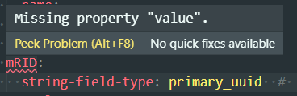
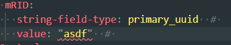
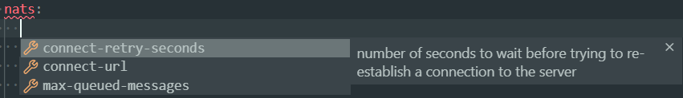
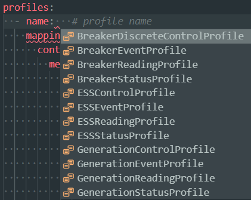
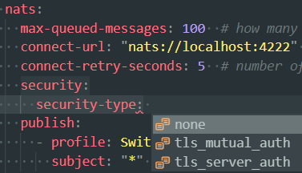
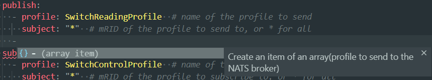
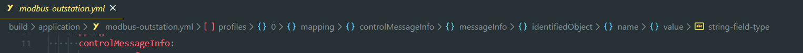
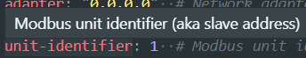

# Schemas

## Introduction

JSON schema is a standardised way to describe the content of JSON documents. Since
YAML is a superset of JSON, it can also be used to describe YAML so long as advanced YAML
functionality is not used. The standard for JSON schemas are defined in this
[document](https://json-schema.org/draft/2019-09/json-schema-core.html).

## Generating the schemas

The adapter can generate schemas describing all of its configuration files. To generate a schema,
use the `-s` argument of the CLI. There is one schema for the root-level configuration and a schema 
for each plugin that needs a separate configuration file. For example:

```bash
> openfmb-adapter -s config.json
> openfmb-adapter -s dnp3-master.json -p dnp3-master
```

## Visual Studio Code integration

Visual Studo Code provides excellent support for edting YAML documents constrained by a JSON schema.

To ease the editing of configuration files, here's the suggested setup.

1. Generate all the schemas needed by your configurations using the OpenFMB CLI.
2. Download and install [Visual Studio Code](https://code.visualstudio.com/)
3. Install the [Red Hat YAML extension](https://marketplace.visualstudio.com/items?itemName=redhat.vscode-yaml)
4. In a file named `.vscode/settings.json` inside your working directory, add
   the following items:
```json
"yaml.schemas": {
    "schemas/schema.json": ["config/config*.yml"],
    "schemas/dnp3-master.json": ["config/dnp3-master*.yml"],
    "schemas/dnp3-outstation.json": ["config/dnp3-outstation*.yml"],
    "schemas/modbus-master.json": ["config/modbus-master*.yml"],
    "schemas/modbus-outstation.json": ["config/modbus-outstation*.yml"],
    "schemas/goose-pub.json": ["config/goose-pub*.yml"],
    "schemas/goose-sub.json": ["config/goose-sub*.yml"]
},
```
You can customize the configuration here to your particular setup. The first
argument (e.g. `schemas/schema.json`) points to a schema file. It is associated
with a list of files for which this schema is applied. If you have multiple
configuration files using the same schema, you can list them here. Or, as I did
in the example, you can use the wildcard character `*` to match multiple files
that follows the same pattern.

### Features

Then, you can open a configuration file in VS Code and have the following
features:

- Missing field highlighting

  

- Validation of field values

  

- Auto-complete of missing fields by pressing CTRL-SPACE

  

- Auto-complete enum variants by pressing CTRL-SPACE

  
  

- Auto-create an item of an array by writing an hyphen then pressing TAB

  

- A breadcrumb to show you where your cursor is positioned in the file's
  hierarchy

  

- Inline description of fields on mouse hovering

  
