# Single-Line Diagram

A single-line diagram, also sometimes called one-line diagram, gives you an overview or part of an electrical power system.  In this section, you'll learn how to use OpenFMB HMI tool to build a single-line diagram that represents a very simple micrgrid.  

In this section, you will be setting up the signle-line diagram based on the [Referenced Setup](../tutorial/reference).

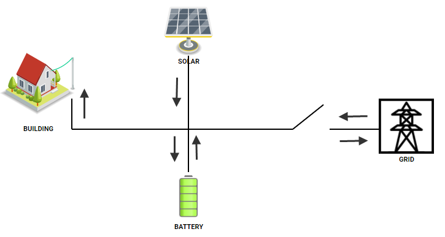

## To Build The Diagram

1. First, we need to add the four equipment that we identified above.  On OpenFMB HMI side navigator menu, click on Settings, then click on Devices

2. For each equpment, click on "ADD DEVICE" to bring up the add device dialog and enter the following information
    - Building Load (using Meter as measurement equipment)
        - Name: Meter
        - Device Type: meter
        - MRID: `0648ef71-cb63-4347-921a-9dbf178da687`
    - Solar PV:
        - Name: Solar
        - Device Type: solar
        - MRID: `540b292a-e600-4ae4-b077-40b892ae6970`   
    - Battery Energy Storage:
        - Name: Battery
        - Device Type: ess
        - MRID: `836a8638-b448-4961-8258-47aa18e05f65`
    - Switch at PCC:
        - Name: Switch
        - Device Type: switch
        - MRID: `e6768784-48ad-40e9-af2a-9676413d4d6a`
    
   The device list shall look like this:

    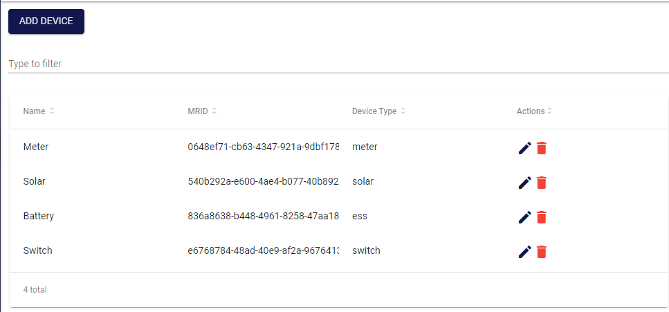

3. On OpenFMB HMI home page, click on "Diagrams"

4. Click on "ADD DIAGRAM" button and fill out diagram's name, description, and location.  
 
5. Click "SAVE" to save

6. On Action column of the newly created diagram, click the "Design" icon to bring up design canvas for the diagram

    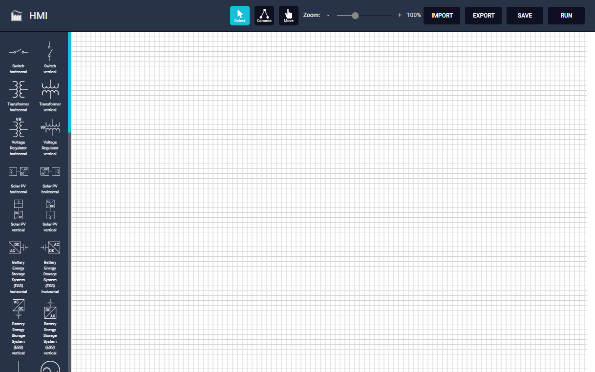

7. Drag and drop symbols (on left panel) onto the canvas.  We need:
    - A Uncontrollable Load symbol (for build load) 
      - 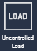
    - A Solar Panel symbol
      - 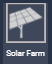
    - A Battery Energy Storage System (ESS) symbol
      - 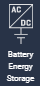
    - A Breaker(or Switch) symbol
      - 
    - A Feeder symbol to represent distribution grid (for completeness)
      - 

8. We need to assign the symbol with its MRID for identification purpose.  For each symbols that we just dropped onto the canvas:
    - **Double click** on the symbol to bring up `Symbol Property Dialog`
    - On the dialog name drop down, select the appropriate device to assign to the symbol.  Note that the MRID is automatically populated according to the selection
    - On label text box, enter label text to be display on the diagram (optional)
    
    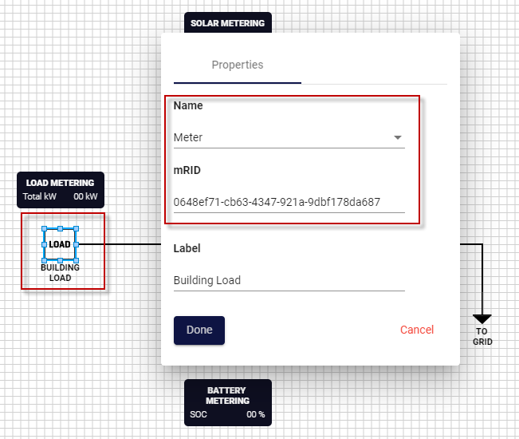
    
8. To connect the symbols, select "Connect" menu on top panel.  For each symbol we want to connect:
    - hover your mouse over the symbol connection port (the connection port is highlighted in green when hovered over) 
    - select and hold down mouse and drag to other symbol connection port

    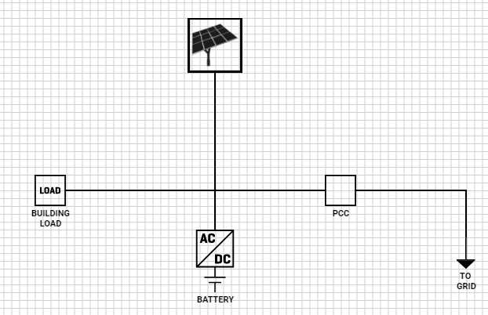

9. At this point, we have a basic single-line diagram that represent our microgrid, but it is not yet useful.  We need measurement displays to monitor readings and/or status from our equipment.  We need to add three `measurement boxes` to the canvas: one for each building load, solar, and battery. 

    - Drag `measurement box` to canvas
    - Select name
    - Enter label text

10. Now for the three measurement boxes, we need to tell the system what data item to display on the box, or in this tool's terminilogy, it is `Data Connection`.

    - **Double click** on the measurement box to bring up `Symbol Property Dialog`
    - Click on "Data Connection" to go to "Data Connection" screen
    - For data connection and mapping, the screen has two main panels:
        - Left Panel: list of items to be displayed on measurement box
        - Right Panel: navigate through OpenFMB modules, profiles, and select data items to add to left panel            
            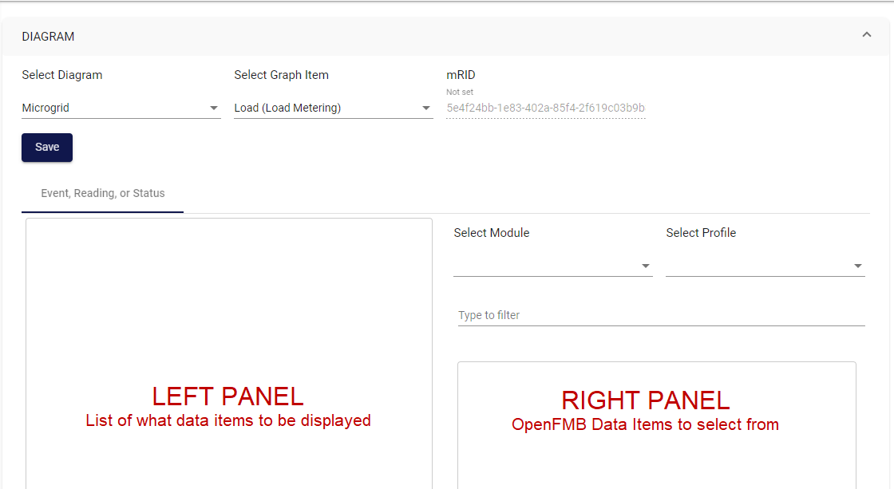
    - For the Building Load, we want to monitor the total power consumption (Total kW):
        - On right panel, select `loadmodule` module, the select `LoadReadingProfile`
        - Filter or navigate to `readingMMXU.W.net.cVal.mag` and click `+` button to add to left panel
            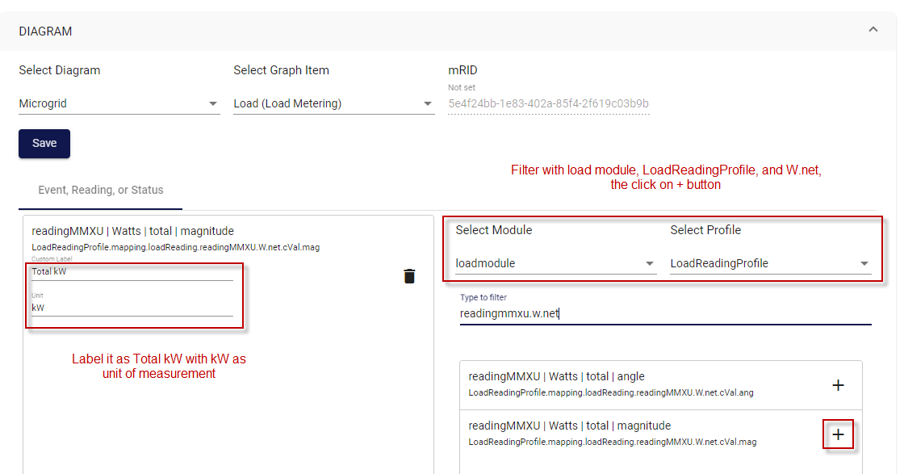
    - For the Solar, we want to monitor the total power production (Total kW):
        - On right panel, select `solarmodule` module, the select `SolarReadingProfile`
        - Filter or navigate to `readingMMXU.W.net.cVal.mag` and click `+` button to add to left panel
    - For the Battery, we want to monitor the current State of Charge (SOC %):
        - On right panel, select `essmodule` module, the select `ESSStatusProfile`
        - Filter or navigate to `essStatus.essStatusZBAT.Soc.mag` and click `+` button to add to left panel 
            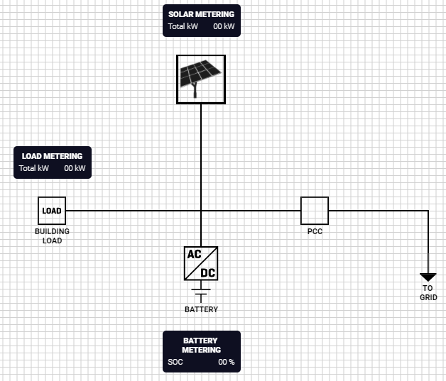           

11. We now have the measurement boxes for monitoring reading and status.  One more step we need to do is to `data connect` on the Switch (PCC) so that it shows correct position (Open/Close) and allows trip/close operations

    - **Double click** on the switch/breaker symbol to bring up `Symbol Property Dialog`
    - Click on "Data Connection" to go to "Data Connection" screen
    - To map the switch position:
        - Select `Event, Reading, or Status` tab on left panel
        - On right panel, select `switchmodule` module, the select `SwitchStatusProfile`
        - Filter or navigate to `switchStatus.statusAndEventXCBR.Pos.phs3.stVal` and click `+` button to add to left panel
    - To map the switch control for trip/close operations:
        - Select `Control` tab on left panel
        - On right panel, select `switchmodule` module, the select `SwitchDiscreteControlProfile`
        - Filter or navigate to `switchDisc...eControlXCBR.discreteControlXCBR.Pos.phs3.ctlVal` and click `+` button to add to left panel
    
## Run The Diagram

Click on `RUN` button on top right corner to put the diagram in run mode.