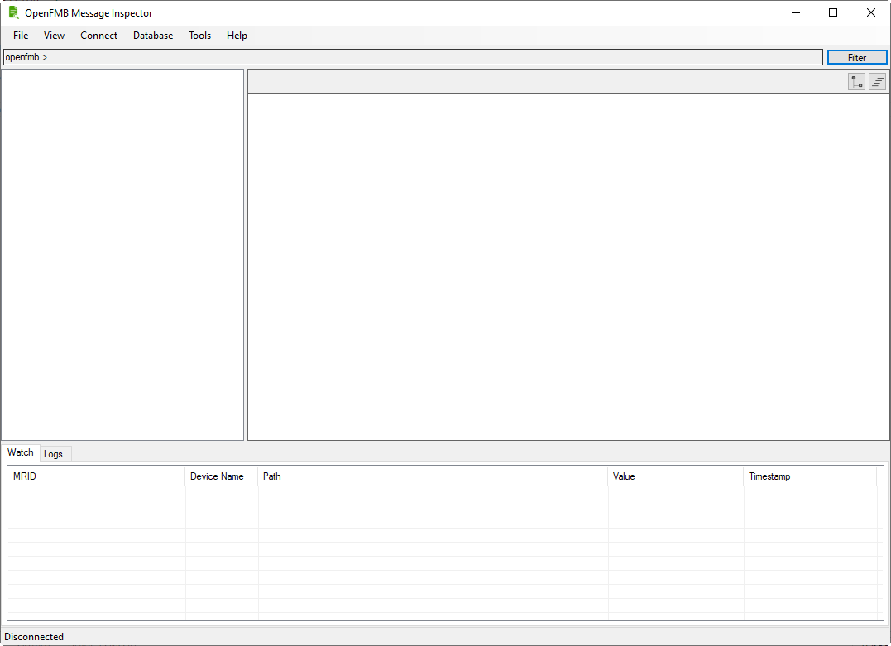
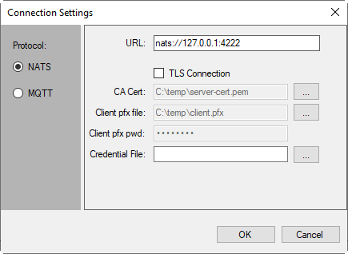
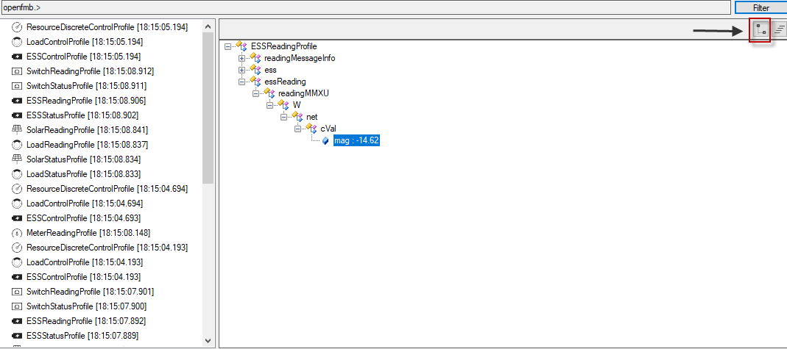
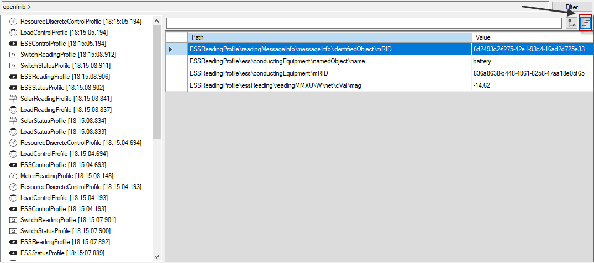
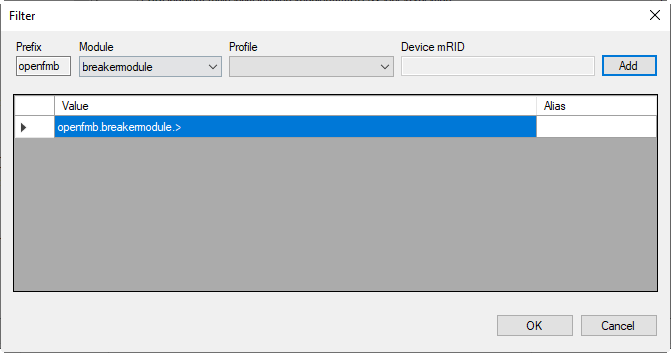

# Overview

Follow these step to run OpenFMB Message Inspector:

1. When you run the OpenFMB Message Inspector, the tool looks like this:

   

2. To specify what publish/subscribe protocol to use, click `Connect` menu and then select `Connection Settings`

   

3. Enter connection URL for specified protocol and click OK

4. Click `Connect` menu and then select `Start`.  Messages start to flow and fill up the left panel by the orders they arrive.

5. Click on a message on the left panel to inspect it

6. The detail message can be viewed as tree structure or table by click on "Tree" or "Table" icon on top right corner of the detail panel

    - Tree view:
    
      

    - Table view:
    
      

7. You can use Filter to inspect specific profile types.  Click on Filter button and add or remove profiles to be filtered.

   