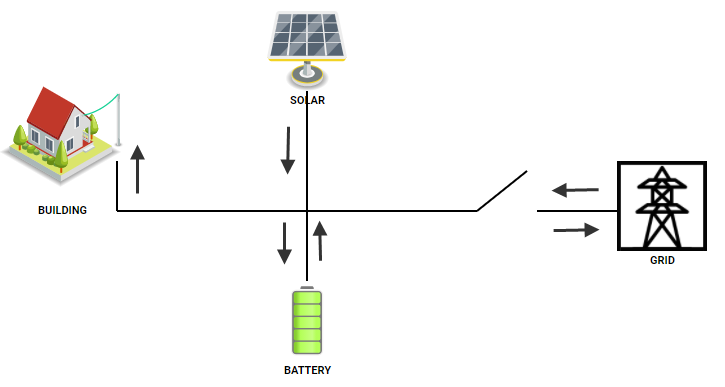

# Reference Setup

In this reference setup you will see how to use OpenFMB with open source software
from [Open Energy Solutions Inc](https://openenergysolutionsinc.com).

The reference setup uses Docker and Docker Compose to run several
pre-built docker images containing open source software developed by Open Energy
Solutions and others.

1. A [nats](https://nats.io) message broker
2. A [openfmb.adapter](https://github.com/openenergysolutions/openfmb.adapters) replaying pre-recorded data
3. A [openfmb.hmi](https://github.com/openenergysolutions/openfmb.hmi) HMI for visualizing and displaying the data coming from the adapter over NATS.

## Installing Docker Compose

In order to run the demonstration you will need Docker and Docker Compose

Installing Docker Compose can be done by following the instructions at

[Install Docker Compose](https://docs.docker.com/compose/install/)

## Get The Demo Configuration

Next an archive of the demonstration setup can be obtained 

[Download Archive](https://github.com/openenergysolutions/openfmb.demo/archive/refs/heads/develop.zip)

## Running the Demo

Once you have the demo zip file, unzip it in a place of your choosing.

In Linux or Mac open a terminal. On windows open the command line. cd into the unzipped demo directory and simply run

docker-compose up

At this point the demo setup should be running.

## Overview

The following steps are progressed to the referenced setup:

1. Identify the electrical equipment and how they are connected (see [below](reference#basic-microgrid))

2. Identify the OpenFMB profiles to be used (see [below](reference#openfmb-profiles))

3. Gather DNP3/MODBUS point list for each equipment 

4. Configure the adapters (see [Adapter Config Tool](../adapter-config-tool/reference))

5. Build the single-line diagram (see [HMI](../hmi/sld))

6. Stand up a [NATS](https://nats.io) broker

7. Run the adapters (see [Adapter](../adapter/index))

8. Run the HMI (see [HMI](../hmi/run))

## Basic Microgrid

A typical scheme of an electrical based microgrid with solar as renewable energy resource would be:

There are four electrical equipment to represent on the single-line diagram.  Note that for simplicity, we don't need to draw any of the transformers nor AC/DC converters.

- Building Load: power consumption
- Solar PV: power production from solar panels
- Battery Energy Storage: charge from solar and discharge to supply power
- Switch (isolator) at PCC (Point of Common Coupling): connect and disconnect to larger distribution grid

We want to design our single-line diagram such that an operator can:

- Monitor the power consumption
- Monitor the power production from solar
- Monitor the State of Charge (SOC) of the battery
- Island or reconnect to distribution grid

## OpenFMB Profiles

The following OpenFMB profiles are being used for this referenced setup:

- Build Load:
    - <ins>MeterReadingProfile</ins>: provides kW being consumed by the building 
- Solar PV:
    - <ins>SolarStatusProfile</ins>: provides the current state of the solar system (either On or Off)
    - <ins>SolarReadingProfile</ins>: provides kW being produced by the solar system
- Battery Energy Storage:
    - <ins>ESSStatusProfile</ins>: provides current state (On/Off) and mode (ISO/PQ) of the battery
    - <ins>ESSReadingProfile</ins>: provides charge/discharge kW by the battery
- Switch (Isolator): 
    - <ins>SwitchStatusProfile</ins>: provides current switch position (Open/Close)
    - <ins>SwitchReadingProfile</ins>: provides kW being imported or exported to the distributed grid

## Device MRID

In this referenced setup, we use the following MRIDs:

- Building Load Metering: `0648ef71-cb63-4347-921a-9dbf178da687`
- Solar PV: `540b292a-e600-4ae4-b077-40b892ae6970`
- Battery Energy Storage: `836a8638-b448-4961-8258-47aa18e05f65`
- Switch (isolator) at PCC: `e6768784-48ad-40e9-af2a-9676413d4d6a`
