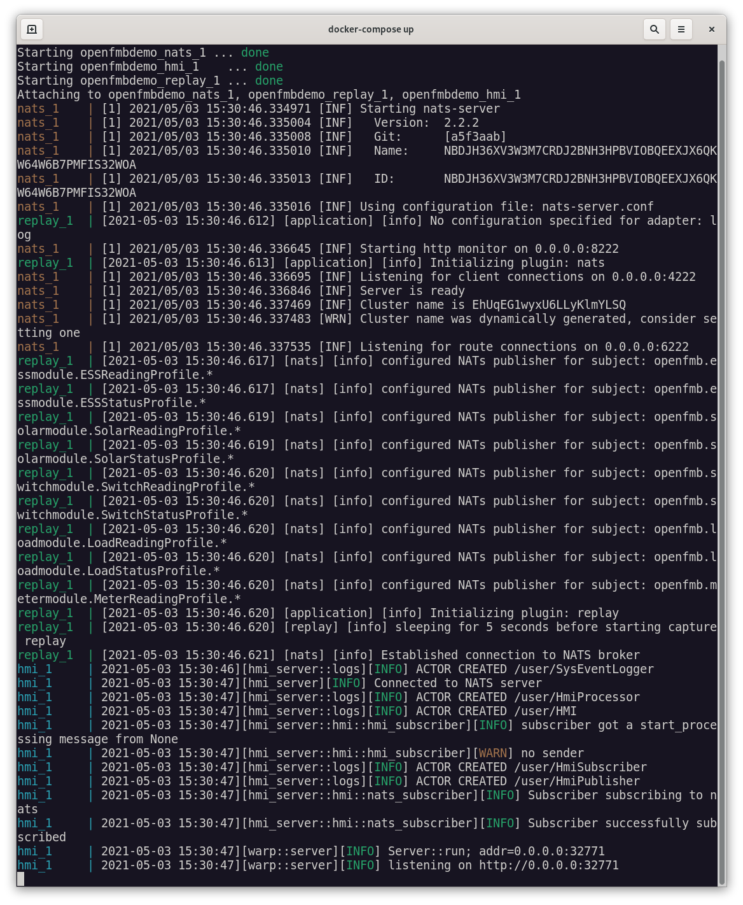
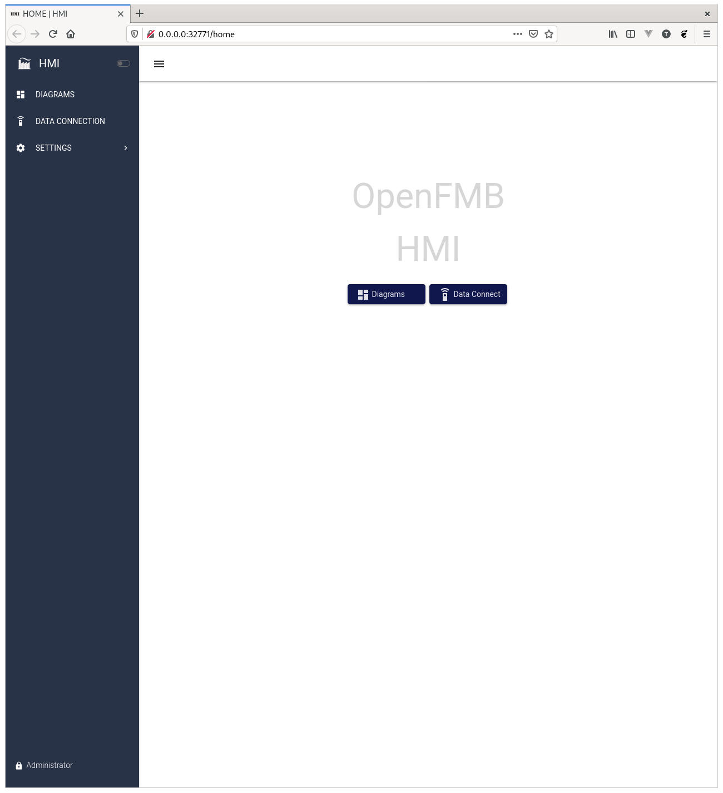
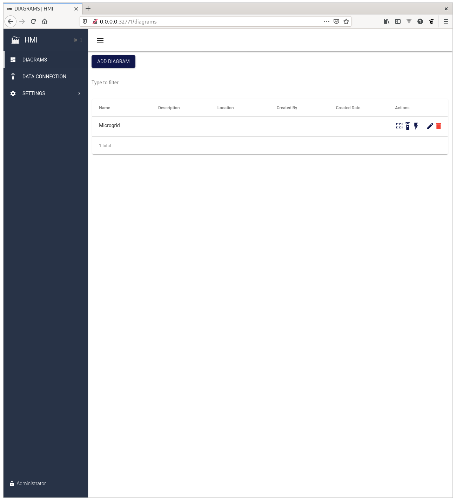
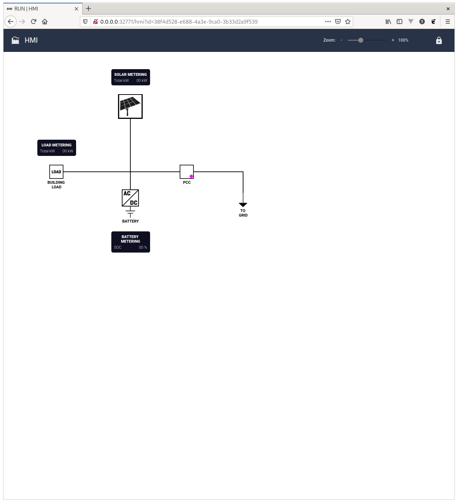

# Reference Setup

In this reference setup you will see how to use OpenFMB with open-source software from [Open Energy Solutions Inc](https://openenergysolutionsinc.com).

The reference setup uses Docker and Docker Compose to run several pre-built Docker images containing open-source software developed by Open Energy Solutions and others. 

The three docker images that are run in the reference setup are: 
1. A [NATS](https://nats.io) server
2. An [Adapter](https://github.com/openenergysolutions/openfmb.adapters) replaying pre-recorded data
3. An [HMI](https://github.com/openenergysolutions/openfmb.hmi) for visualizing and displaying the data coming from the Adapter over NATS.

## Install Docker Compose

In order to run the demonstration, you will need to [install Docker and Docker Compose](https://docs.docker.com/compose/install/). 

## Get The Demo Configuration

Next, [download an archive](https://github.com/openenergysolutions/openfmb.demo/archive/refs/heads/develop.zip) of the demonstration setup.

## Run the Demo

Unzip the demo zip file in a place of your choosing. 

On Linux or Mac, open a terminal. On Windows, open a cmd.exe or PowerShell terminal. Next, change directory (cd) to the unzipped demo directory and run the following command: 

```bash
docker-compose up
```

At this point terminal should look similar to the following: 




## Browse to the HMI


The HMI is accessible locally while Docker Compose is running. 

[http://localhost:32771](http://localhost:32771) 

Log in with the username 'admin' and the password 'hm1admin'. 

The first screen should look similar to the following: 



Browsing first to Diagrams.



Then to the microgrid diagram.



The information on the screen should update in real time. 

## What's Happening in the Background

The values updating in the HMI come from the Adapter publishing pre-recorded OpenFMB messages encoded as [protocol buffers](https://developers.google.com/protocol-buffers/) with [NATS](https://nats.io) acting as a message broker.

You should see replay_1 log messages in the console. Those are coming from the [Adapter](https://github.com/openenergysolutions/openfmb.adapters).

## Where to Go From Here

The [Adapter](https://github.com/openenergysolutions/openfmb.adapters) is capable of much more than replaying data. It’s capable of mapping simulated and real devices that provide commonly used power grid protocols such as DNP3 and Modbus. 

The Adapter can also record all messages to a [PostgreSQL](https://postgresql.org)-powered
[TimescaleDB](https://timescaledb.com),allowing for offline data analysis, dashboards powered by [Grafana](https://grafana.com) or other such visualization tools.

Lastly, the Adapter is the basis for a broader set of software Open Energy Solutions Inc. is developing to enable distributed intelligence for the power grid. 

:::info
If you would like to learn more or discuss how we can help, please [contact us](mailto:support@openenergysolutionsinc.com?subject=Adapter)
:::
